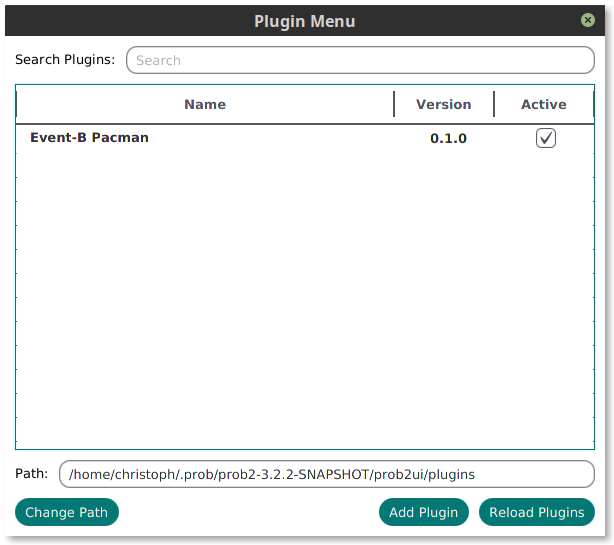

# A plugin mechanism for ProB2-UI

This fork adds a plugin mechanism to the ProB2-UI application. 
As framework we use the [Plugin Framework 4 Java](https://github.com/decebals/pf4j). 

The following sections describe how these plugins can be used in ProB2-UI and how you can develop your own plugins.

## Developing a plugin

In the following we assume that you use [gradle](https://gradle.org/) as build tool.

Currently this project isn't published, so have to clone/download the repository and add it as a dependency to your plugin project.
To add the dependency add the following lines to your `settings.gradle` file. Replace `[PATH]` with the path of your copy of this project.

```
include ':prob2-ui'
project(":prob2-ui").projectDir = file("[PATH]")
```

In the `build.gradle` file you need to add the following line in the dependencies block.

```
compileOnly project(':prob2-ui') 
```

There are three classes that you need to know about if you want to develop your own plugins. 
These classes are:
* <b>ProBPlugin:</b><p>
   Extends the plugin class of [PF4J](https://github.com/decebals/pf4j). For your own plugin you need a class which extends this one.
   In the `startPlugin()` method you should create your plugin and add all the UI-elements and listeners your plugin need. -
   In the `stopPlugin()` method it is necessary to remove all added listeners and UI-elements.
* <b>ProBPluginManager:</b><p>
   Is a wrapper for the ProBJarPluginManager. Has methods to add plugins and handles the state of plugins.
   The ProB2-UI application uses only one singleton instance of the ProBPluginManager.
* <b>ProBJarPluginManager:</b><p>
   Extends the `JarPluginManager` class of [PF4J](https://github.com/decebals/pf4j).
   You can use this class to manage the plugins and extension points you need in your plugin.
* <b>ProBConnection:</b><p>
   This class is a connection between your plugin and the ProB2-UI application. It has some methods 
   to add elements to GUI (like tabs for ex.).
  
If you want to use other classes of the ProB2-UI project,
please use the Guice-injector. You can get an instance of the injector with the
`getInjector()`-method of the ProBPlugin class.  

To build your plugin, add the following code to your `buid.gradle` file. 
You have to replace the values in brackets with your own values. A example is shown in the 
[EventB-Pacman](https://github.com/heinzware/EventBPacman-Plugin) plugin repository. 
The `PROB_VERSION` value has to match the ProB2-UI version you are targeting.

```
jar {
    baseName = 'EventB-Pacman'
    version = '0.1.0'
    manifest {
        attributes 'Plugin-Class' : '[PLUGIN_CLASS]',
                'Plugin-Id' : '[PLUGIN_ID]',
                'Plugin-Version' : '[PLUGIN_VERSION]',
                'Plugin-Provider' : '[PLUGIN_PROVIDER]',
                'Plugin-Requires' : '[PROB_VERSION]'
    }
    from {
        configurations.compile.collect { it.isDirectory() ? it : zipTree(it) }
    }
}
```
## Using a plugin


To add a plugin, go to _Plugins -> Add Plugin_ or _Plugins -> Plugin Menu -> Add Plugin_.
This opens a file chooser where you can select the plugin you want to add.

Added plugins are shown in the plugin menu. Here you can activate/deactivate them.
These plugins are stored in a plugins folder and are automatically loaded/started when you start the ProB2-UI application.

You can change the directory where the application stores the plugins with the button "Change Path" (see image above).

