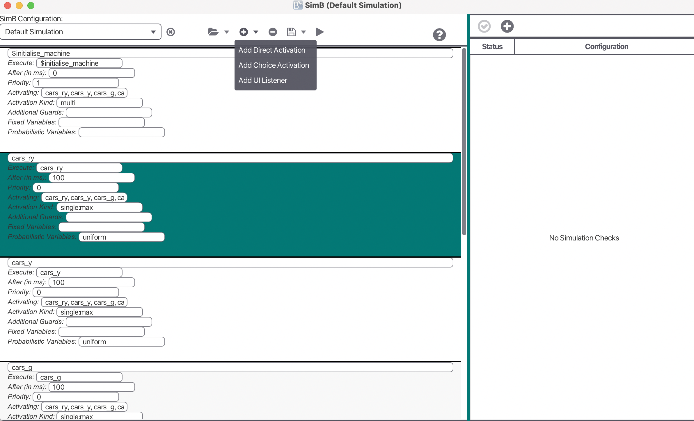
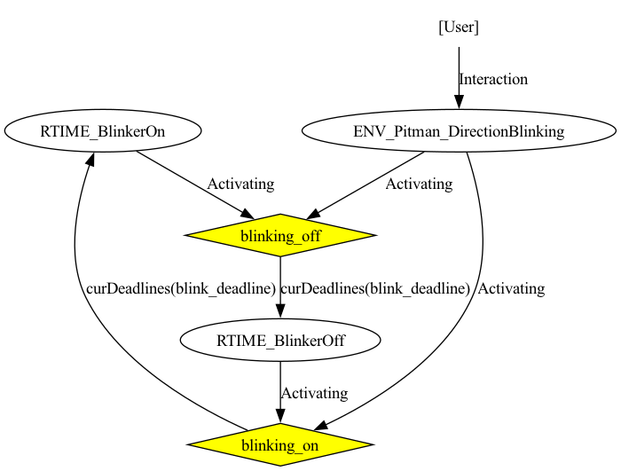

<!-- \newpage -->


# General Information

SimB is a simulator built on top of ProB. 
It is available in the latest SNAPSHOT version in the new JavaFX based user interface [ProB2-UI](https://github.com/hhu-stups/prob2_ui). 
The modeler can write SimB annotations for a formal model to simulate it. 
Examples are available at [https://github.com/favu100/SimB-examples](https://github.com/favu100/SimB-examples). 

Furthermore, it is then possible to validate probabilistic and timing properties with 
statistical validation techniques such as hypothesis testing and estimation.

SimB also contains a feature called interactive simulation. 
This feature allows user interaction to trigger a simulation. 
For interactive simulation, a modeler has to encode SimB listeners on events, triggering a SimB simulation. 
Interactive Simulation examples are available at [https://github.com/favu100/SimB-examples/tree/main/Interactive_Examples](https://github.com/favu100/SimB-examples/tree/main/Interactive_Examples).


More recently, SimB is extended by a new feature which makes it possible to load an Reinforcement learning Agent. 
Technically, each step of the RL agent is converted into a SimB activation. 
In order to simulate a RL agent in SimB, one must (1) create a formal B model for the RL agent, and 
(2) create a mapping between the state in the RL agent and the formal model, and 
(3) provide information to the formal B model again. 
Reinforcement Learning examples are available at: [https://github.com/hhu-stups/reinforcement-learning-b-models](https://github.com/hhu-stups/reinforcement-learning-b-models)


# First Steps

To use SimB, make sure that ProB2-UI is installed.

## Open a Simulation

SimB is accessible via the the menu in ProB2-UI: 
`Advanced >> SimB`. 


Once the SimB window is opened, SimB loads a simulation.
This is either a simulation that is stored in the ProB2-UI project as the first one,
or it is the default simulation.
The default simulation is created when no simulations are stored for the machine in the project file.
Furthermore, default simulation which always execute the first possible event after 100 ms in an endless loop.
This is shown below.


On the left-hand side, there is a editor to modify the simulation.
On the right-hand side, there is a table to add validation tasks, applying techniques like
`Monte Carlo Simulation`, `Hypothesis Testing`, and `Estimation`.
This is discussed in this tutorial later in more detail.

## Start a Simulation

As soon as a simulation is loaded, the machine can be simulated and animated.
The simulation can then be started by clicking on the `Play Button`.
By clicking on the `Play Button`, the simulation runs as a real-time simulation.


With real-time simulation, the modeler can then manually check whether the model behaves as desired.
Combining VisB and SimB, a simulation can be seen as an animated picture similar to a GIF picture. 
This allows to create a more realistic prototype and gives the domain expert even a better understanding of the model. 
With SimB listeners, it is also possible to encode simulations that are triggered by manual/user actions at runtime.

In this example, the default simulation would be started.
One can also load another simulation which was created/saved before.


## Loading Simulation

In order to load, a simulation, one has to click on the `Open File` button.
There are three main options:

- `Load SimB Configuration` to open a SimB activation diagram in JSON format
- `Load SimB traces` to open a directory which contains timed traces
- `Load External Simulation` to open an external simulation, e.g., a simulation of a reinforcement learning agent in its environment

In the following, we focus on the standard option to load a SimB configuration.
The other options, i.e., `Load SimB traces` and `Load External Simulation` work in the same way.


A SimB simulation can be opened via the `Open File`. 
This leads to a context menu with the three aforementioned option.
Clicking on the `Load SimB Configuration` button (as shown in the Figure) opens a File Dialog.
Clicking on the `Load SimB traces` and `Load External Simulation` buttons also open a File dialog (not shown here).


Regarding the option to load a SimB configuration, 
the user can choose a SimB simulation in a `JSON presentation` in the File Dialog (shown in the Figure).
The SimB configuration is then loaded into SimB.

For the option to load SimB traces, the user has to choose a directory which contains the timed traces in SimB.
For the option to load an external simulation, the user has to choose an executable file.
Currently, it supports the `.py` format for AI simulations, particularly, reinforcement learning agents in an environment.

The user must then switch the current SimB simulation through the `ChoiceBox` on the top-left of the SimB window (shown in Figure).
This option also works for loading a directory with a set of traces, and an external simulation similarly.


## Creating and Modifying a Simulation

In the following, we focus on the option to create and modify a SimB configuration.
The SimB configration has to match the format which encodes a SimB activation diagram.
Simulations given by a set of traces are usually created by saving traces after a Monte Carlo simulation.
External simulations are usually implemented in a specific format which is later explained in this tutorial as well.

A SimB configuration can be simply created within a standard editor.
Another possibility is to use the SimB editor within the SimB window.
On the left-hand side of the SimB window, there is at least the default simulation which contains the corresponding diagram.
Otherwise, one can also load an existing SimB configuration and modify it in the SimB editor.

Here, one can remove existing elements in the diagram by clicking on the minus button after selecting an
element in the SimB activation.




Again, one can add new elements into the activation diagram.
Therefore, one has to click onto the plus button which shows a context menu.
The context menu consists of `MenuButtons` to add elements into the activation diagram: 
*direct activations*, *probabilistic choices*, and *UI listeners*.
Detailed explanation about those elements will be given later in this tutorial.

There are two buttons to save the modified SimB activation diagram:
`Save` and `Save as...` which both implement the well-known behavior from other applications.

Furthermore, there are more options to save SimB configurations.
`Save Trace` can be clicked to save the currently animated trace in the format of ProB2-UI.
Note that this option does not save a timed trace.
`Save Timed Trace` can be used to save the currently simulated trace as a timed trace in SimB's format.
`Save User Interactions` can be used for simulations which have interactive elements.
This option can be used to save a SimB activation diagram which adds *UI listeners* that are applied
by the user in ProB2-UI.
These user interactions are either applied through the ProB animator or through VisB.


# Simulation with SimB

SimB can load simulations in the following forms:

- SimB activation diagram in  `.json` format (standard use case)
- Directory with a set of timed traces
- External simulation as any executable


In the following, we will describe how these simulations are created.


## SimB Activation Diagram

A SimB JSON file encodes an activation diagram, and consists of SimB activations and SimB listeners to simulate the model. 
SimB activations encode an activation diagram with probabilistic and timing elements for automatic simulation. 
To enable interactive simulation, it is also necessary to encode interactive elements aka. 
SimB listeners which trigger other SimB activations. 
Within these elements, the modeler can user B expressions which are evaluated on the current state. 
The general structure of a SimB activation diagram is as follows:

~~~json
{
  "activations": [...],
  "listeners": [...]
}
~~~

- `activations` stores SimB activations
- `listeners` (optional; defaults to empty list) stores SimB listeners


### Probabilistic and Timing Elements

A SimB activation diagram in JSON always contains an `activations` 
field storing a list of probabilistic and timing elements to control the simulation. 
Probabilistic values are always evaluated to ensure that the sum of all possibilities is always 1. 
Otherwise an error will be thrown at runtime. 
There are two types of activations: *direct activation* and *probabilistic choice*. 
All activations are identified by their `id`.

**Direct Activation.** A *direct activation* activates an event to be executed in the future. 
It requires the fields `id`, and `execute` to be defined. 
All other fields can be defined optionally.
Thus, a *direct activation* is of the following form:

```.json
{
   "id":  ...,
   "execute": ...,
   "after": ...,
   "activating": ...,
   "activationKind": ...,
   "additionalGuards": ...,
   "fixedVariables": ...,
   "probabilisticVariables": ...,
   "priority": ...
}
```

The explanation of each field is as follows:

- `execute` identifies the activated event by its name. 
- `after` defines the scheduled time (in ms) when activating an event. By default, it is set to 0 ms, e.g., when this field is not defined explicitly.
- `activating` stores events that will be activated when executing the event defined by execute. Missing definition leads to the behavior that no other events are activated. The modeler can either write a `String` (to activate a single event) or a list of `Strings` (to activate multiple events)
- `activationKind` stores the kind of activation for execute:
  - `multi` (default) means that the activation will be queued for execution.
  - `single` means that the activation will only be queued if there are no queued activations with the same id
  - `single:min` means that the activation will only be queued if (1) there are no queued activations for the same id or (2) there is a queued activation with the same id whose value for the scheduled time is greater. In the case of (2), the already queued activation will be discarded.
  - `single:max` means that the activation will only be queued if (1) there are no queued activations for the same id or (2) there is a queued activation with the same id whose value for the scheduled time is lower. In the case of (2), the already queued activation will be discarded.
- `additionalGuards` stores optional guards when executing the event stored in execute.
- `fixedVariables` stores a Map. Here, a variable (parameter, or non-deterministic assigned variable) is assigned to its value.
- `probabilisticVariables` stores either a Map or a String. Concerning the Map, a variable (parameter, or non-deterministic assigned variable) is assigned to another Map defining the probabilistic choice of its value. The second Map stores Key-Value pairs where values are mapped to the probability. The modeler can also assign probabilisticVariables to first or uniform.
- `first` means that the first transition is chosen for execution.
- `uniform` means that a transition is selected from all alternatives uniformly.
- `priority` stores the priority for scheduling execute. Lower number means greater priority.

**Probabilistic Choice.** A *probabilistic choice* selects an event to be executed in the future. 
It requires the two fields `id`, and `chooseActivation`. 
`chooseActivation` is a `Map` storing `Key-Value` pairs where `activations` (identified by their `id`) 
are mapped to a probability. 
It is possible to chain multiple *probabilistic choices* together, 
but eventually, a *direct activation* must be reached.
The sum of the probabilities must evaluate to 1 here.
Thus, a *probabilistic choice* is of the following form:

~~~json
{
  "id":  ...,
  "chooseActivation": ...
}
~~~

**Example 1: SimB Activation Diagram with Direct Activations and Probabilistic Choice.** In the following, an example for a SimB file controlling traffic lights for cars and pedestrians (with timing and probabilistic behavior) is shown.
`choose` is an *probabilistic choice*. `$initialise_machine`, `cars_ry`, `cars_g`, `cars_y`, `cars_r`, `peds_g`, `peds_r` are *direct activations*.

~~~json
{
  "activations": [
    {"id":"$initialise_machine", "execute":"$initialise_machine", 
    	"activating":"choose"},
	{"id":"choose", "chooseActivation":
  	    {"cars_ry": "0.8", "peds_g": "0.2"}},
    {"id":"cars_ry", "execute":"cars_ry", "after":5000, 
	    "activating":"cars_g"},
	{"id":"cars_g", "execute":"cars_g", "after":500, 
	    "activating":"cars_y"},
    {"id":"cars_y", "execute":"cars_y", "after":5000, 
	    "activating":"cars_r"},
    {"id":"cars_r", "execute":"cars_r", "after":500, 
	    "activating":"choose"},
    {"id":"peds_g", "execute":"peds_g", "after":5000, 
	   "activating":"peds_r"},
    {"id":"peds_r", "execute":"peds_r", "after":5000, 
	    "activating":"choose"}
  ]
}
~~~

A graphical representation of this diagram is shown below.

{ width=40% }

### Interactive Elements

Interactive elements in SimB are so called SimB listeners. 
A SimB listener consists of four fields `id`, `event`, `predicate`, and `activating`. 
This means that the SimB listener associated with `id` listens on a manual/user interaction 
on event with `predicate` after which activations in `activating` are triggered. 
`predicate` is optional and defaults to `1=1`.
Thus, a listener is of the following form:

~~~json
{
  "id":  ...,
  "event": ...,
  "predicate": ...,
  "activating": [...]
}
~~~

Manual/User interaction is recognized via VisB and ProB's Operations View.

**Example 2: SimB Activation Diagram with User Interaction.** In the following, we show parts of a SimB simulation from an automotive case study. 
The SimB simulation contains a SimB listener which is linked to two activations. 
The case study models the car's lighting system controlled by pitman controller, the key ignition, and the warning lights button.
The SimB listeners states that SimB listens on user interaction on the event `ENV_Pitman_DirectionBlinking`, 
to trigger two SimB activations `blinking_on` and `blinking_off` afterward. 
Practically, this means that a driver's input on the pitman for direction blinking activates the blinking cycle for the corresponding direction indicators.
An example is shown below:

~~~json
{
  "activations": [
    {
    "id": "blinking_on",
    "execute": "RTIME_BlinkerOn",
    "after": "curDeadlines(blink_deadline)",
    "activating" : "blinking_off",
    ...
    },
    {
    "id": "blinking_off",
    "execute": "RTIME_BlinkerOff",
    "after": "curDeadlines(blink_deadline)",
    "activating" : "blinking_on",
    ...
    },
    ...
  ]
  "listeners": [
    {
    "id": "start_blinking",
    "event": "ENV_Pitman_DirectionBlinking",
    "activating" : ["blinking_on", "blinking_off"]
    }
  ]
}
~~~

A graphical representation of this diagram (only the presented part) is shown below.




## Directory with Timed Traces

The second option is about loading a directory which contains a set of *timed traces*.
These *timed traces* are represented in the SimB activation diagram format as well.
Usually, timed traces are created from a *Monte Carlo simulation*.
It would also possible to create these traces from an external source to load them in ProB/SimB for validation purposes.
In this case, one has to create a formal model which matches the variables used in the timed traces.

Regarding real-time simulation, a timed trace is randomly selected from the directory for replay. 
Regarding statistical validation with hypothesis testing and estimation, all timed traces are taken into account.


## External Simulation

The third option is to load an external simulation which is an executable file.
This replaces the JSON file for the SimB simulation.
Yet, SimB supports an external simulation as a Python file (`.py`).
The external simulation controls the execution of the formal model, while the formal model can be used as a safety shield.

Therefore, a communication between the external simulation and ProB, i.e., the formal model must be established.
Before executing an operation, the following messages must be sent:

- 1st message: Sent from ProB Animator: List of enabled operations
- 2nd message: Sent from External Simulation: Name of chosen action/operation
- 3rd message: Sent from External Simulation: Time until executing chosen action/operation
- 4th message: Sent from External Simulation: Succeeding B state as a predicate
- 5th message: Sent from External Simulation: Boolean flag describing whether simulation is finished


### Reinforcement Learning Agent in SimB

In the following, we show how this works for a simulation of a reinforcement learning agent implemented in Python using OpenAI Gym.
Examples can be found here: [https://github.com/hhu-stups/reinforcement-learning-b-models](https://github.com/hhu-stups/reinforcement-learning-b-models).
For a simulation to work in ProB and SimB, one has to apply the following steps:

1. Train a model of a Reinforcement Learning agent.
2. Create a formal B model (including safety shield) for the RL agent.

The operations represent the actions the RL agent can choose from. The formal model's state mainly represents the state of the environment. 
Safety shields are encoded by the operations' guards which are provided to the RL agent. Enabled operations are considered to be safe. 
Thus, the RL agent chooses the enabled operation/action with the highest predicted reward. The operations' substitutions model the desired behavior of the respective actions.

An example for the `FASTER` of a HighwayEnvironment is shown below.
Lines 2-4 shows the operation's guard which is used as safety shield.
Lines 6-15 shows the operation's substitution describing the desired behavior after executing FASTER.

~~~
FASTER =
PRE
  ¬(# v. (v : PresentVehicles \ {EgoVehicle} & VehiclesX(v) > 0.0 
  	& VehiclesX(v) < 45.0 
  	& VehiclesY(v) < 3.5 & VehiclesY(v) > -3.5))
THEN
  Crash :: BOOL ||
  PresentVehicles :: P(Vehicles) ;
  VehiclesX :: Vehicles → R ||
  VehiclesY :: Vehicles → R ||
  VehiclesVx :| (VehiclesVx : PresentVehicles → R &
  VehiclesVx(EgoVehicle) >= VehiclesVx’(EgoVehicle) - 0.05) ||
  VehiclesVy :: Vehicles → R ||
  VehiclesAx :| (VehiclesAx : PresentVehicles → R 
  	& VehiclesAx(EgoVehicle) >= -0.05) ||
  VehiclesAy :: Vehicles → R ||
  Reward :: R
END
~~~


3. Implement the mapping between the RL agent in Python and the formal B model. This includes the mapping of actions to operations, and the mapping of information from the RL agent, particularly the environment and observation, to the variables.

An example for the mapping of actions to operations is as follows:

~~~json
action_names = {
  0: "LANE_LEFT",
  1: "IDLE",
  2: "LANE_RIGHT",
  3: "FASTER",
  4: "SLOWER"
}
~~~

Here, one can see that the numbers representing the actions in the RL agents are mapped to the corresponding operation names in the formal B model.
An example for a mapping to a variable in the formal B model is as follows:

~~~
def get_VehiclesX(obs):
  return "{{EgoVehicle |-> {0}, Vehicles2 |-> {1}, 
           Vehicles3 |-> {2}, Vehicles4 |-> {3},
           Vehicles5 |-> {4}}}"
           .format(obs[0][1]*200, obs[1][1]*200, 
               obs[2][1]*200, obs[3][1]*200, 
               obs[4][1]*200)
~~~

4. Implement necessary messages sent between the ProB animator and the RL agent. The list of enabled operations is used by the RL agent to predict the enabled operation with the highest reward. Simulation should be a while-loop which runs while the simulation has not finished. Example code (line 70 - 113; particularly 86 - 113): [https://github.com/hhu-stups/reinforcement-learning-b-models/blob/main/HighwayEnvironment/HighwayEnvironment.py](https://github.com/hhu-stups/reinforcement-learning-b-models/blob/main/HighwayEnvironment/HighwayEnvironment.py)


# Statistical Validation

By clicking on the *plus button* on the right-hand side, i.e., above the validation task table,
one can add different kinds of statistical validation tasks.
The corresponding Figure is shown below.


Those validation tasks include the following techniques:

- Monte Carlo Simulation
- Hypothesis Testing
- Estimation

## Monte Carlo Simulation

Monte Carlo simulation is used to simulate a certain number of executions as (timed) traces.
The generated scenarios can then be re-played in real-time afterward.


The input parameters are:

- `Number of Simulations` defines the number of simulations to be generated.
- `Max Steps Before Start` defines the number of steps before taking into account the `starting` and `ending conditions`.
- `Starting Condition` defines condition to simulate until before taking `Ending Condition` into account. It is either defined by a `No Condition`, `Number of Steps`, `Starting Time` or `Starting Predicate`.
- `Ending Condition` defines condition to simulate until after taking `Starting Condition` into account (defines the last transition of the simulation). It is either defined by a `Number of Steps`, `Ending Time` or `Ending Predicate`
- `Check` defines the check to apply for the simulation. `Monte Carlo Simulation` means that there are no checks to be applied, while the other options are `Hypothesis Testing` and `Estimation`


The corresponding figure for the validation task window with Monte Carlo Simulation choice
is shown below.

{ width=36% }


## Hypothesis Testing 

`Hypothesis Testing` expects the same parameters as `Monte Carlo Simulation`: 
`Max Steps before Simulation`, `Number of Simulations`, `Starting Condition` and `Ending Condition`.

The additional input parameters for Hypothesis Testing are:

- `Property` defines the property to be checked between `Starting Condition` and `Ending Condition` for each simulation. Possible configurations are:
  - `All Invariants` can be used to check all invariants.
  - `Predicate as Invariant` can be used to provide a predicate to be checked whether it is always true.
  - `Final Predicate` can be used to provide a predicate to be checked in the final state of a simulation.
  - `Predicate Eventually` can be used to provide a predicate to be checked whether it is eventually true.
  - `Timing` can be used to check the time.
- `Hypothesis Check`
  - `Left-tailed` hypothesis test
  - `Right-tailed` hypothesis test
  - `Two-tailed` hypothesis test
- `Probability` (in the hypothesis)
- `Significance Level`

The corresponding figure for the validation task window with Hypothesis testing choice
is shown below.

{ width=36% }


## Estimation 

`Estimation` expects the same parameters as `Monte Carlo Simulation`: `Number of Simulations`, `Starting Condition` and `Ending Condition`.

The additional input parameters for Estimation are:

- `Property` defines the property to be checked between `Starting Condition` and `Ending Condition` for each simulation. Possible configurations are:
  - `All Invariants` can be used to check all invariants.
  - `Predicate as Invariant` can be used to provide a predicate to be checked whether it is always true.
  - `Final Predicate` can be used to provide a predicate to be checked in the final state of a simulation.
  - `Predicate Eventually` can be used to provide a predicate to be checked whether it is eventually true.
  - `Timing` can be used to check the time.
  - `Average` can be used to check the average value of an expression.
  - `Average (Mean between steps)` can be used to check the average value of an expression, computing mean values between two steps.
  - `Cumulative Sum` can be used to check the cumulative sum of an expression.
  - `Cumulative Sum (Mean between steps)` can be used to check the cumulative sum of an expression, computing mean values between two steps.
  - `Minimum` can be used to check the minimum of an expression.
  - `Maximum` can be used to check the maximum of an expression.
- `Estimator`
  - `Minimum Estimator` returns the minimum estimated value from all simulated runs.
  - `Mean Estimator` returns the mean estimated value from all simulated runs.
  - `Maximum Estimator` returns the maximum estimated value from all simulated runs.
- `Desired Value`
- `Epsilon`


For an estimated value `e`, a desired value `d`, and an epsilon `eps`, it checks for each simulation whether `e` is within `[d - eps, d + eps]`.

The corresponding figure for the validation task window with Estimation choice
is shown below.

{ width=36% }


# Citing SimB

To cite SimB as a tool, its timing or probabilistic simulation features, or SimBs statistical validation techniques, please use:

~~~bibtex
@InProceedings{simb,
Author    = {Vu, Fabian and Leuschel, Michael and Mashkoor, Atif},
Title     = {{Validation of Formal Models by 
             Timed Probabilistic Simulation}},
Booktitle = {Proceedings ABZ},
Year      = 2021,
Series    = {LNCS},
Volume    = {12709},
Pages     = {81--96}
}
~~~


To cite SimB's interactive simulation, please use:

~~~bibtex
@InProceedings{simb,
Author    = {Vu, Fabian and Leuschel, Michael},
Title     = {{Validation of Formal Models by 
              Interactive Simulation}},
Booktitle = {Proceedings ABZ},
Year      = 2023,
Series    = {LNCS},
Volume    = {14010},
Pages     = {59--69}
}
~~~

To cite SimB's functionalities to simulate a Reinforcement Learning Agent and Environment, or an environment, please use:

~~~bibtex
@InProceedings{validation_rl,
author    = {Vu, Fabian and Dunkelau, Jannik and 
             Leuschel, Michael},
title     = {{Validation of Reinforcement Learning Agents 
              and Safety Shields with ProB}},
booktitle = {{Proceedings NFM}},
year      = 2024,
pages     = {279--297}
}
~~~


