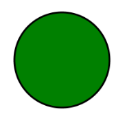
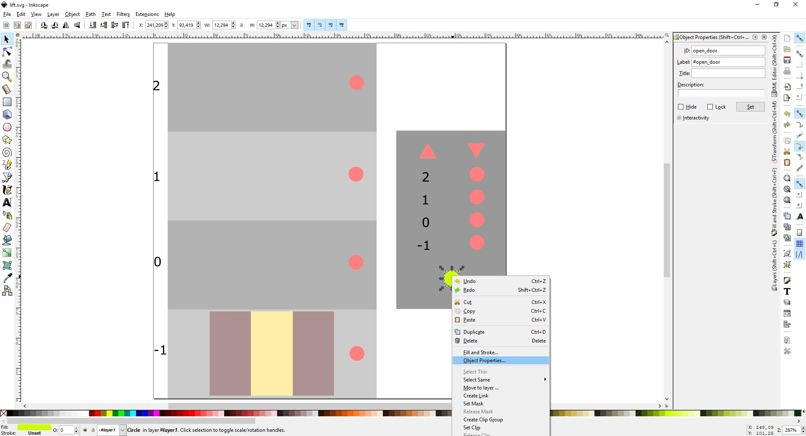
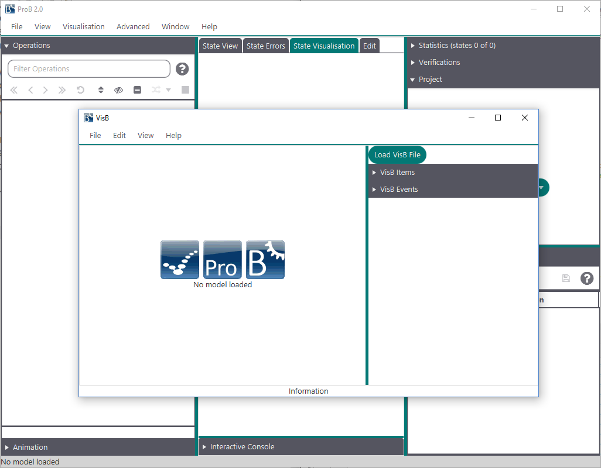
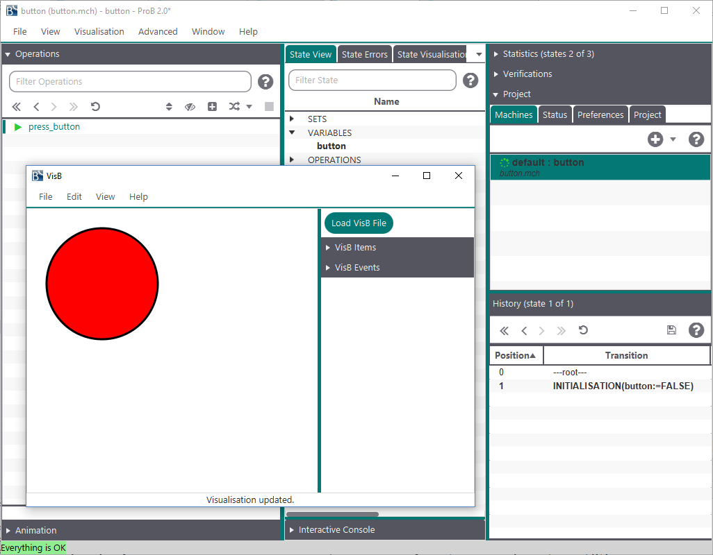
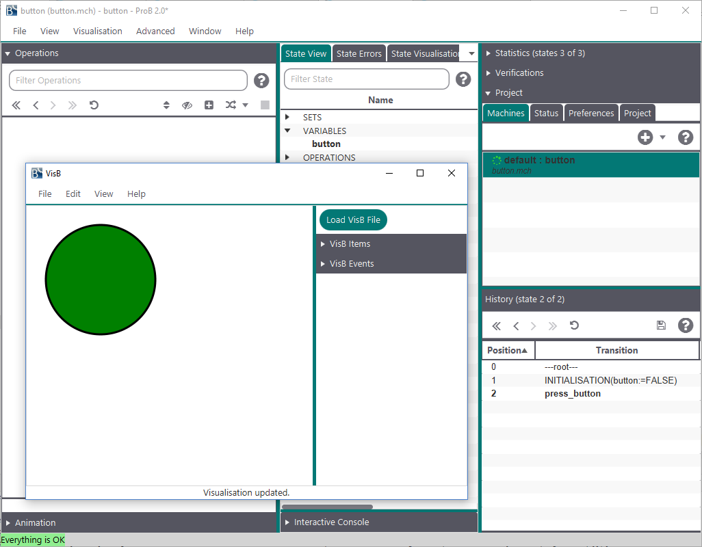

= VisB User Manual

VisB is a visualisation mechanism for ProB2-UI. It enables formal method experts
and domain experts to better communicate with each other by creating visualisations for their B models.

VisB improves upon previous visualisation tools based on ProB:
it is more powerful than the https://prob.hhu.de/w/index.php/Graphical_Visualization[ANIMATION_FUNCTION] feature
and has a lower barrier to entry than https://prob.hhu.de/w/index.php/BMotionWeb[BMotionWeb] (now discontinued).

VisB is designed to work with two input files, one containing the path to the other one.
These input files are the VisB file, in http://www.json.org/[JSON] format, and an  https://developer.mozilla.org/en-US/docs/Web/SVG[SVG] image.
In this manual, you will find three examples on how to create an SVG image.
Additionally, we will explain how to build the VisB files for those images.
All of the following examples can be found in the https://gitlab.cs.uni-duesseldorf.de/general/stups/visb-visualisation-examples[visb-visualisation-examples repository].

== How to Create an SVG Image?

=== Using a Text Editor
Using an editor has the advantage, that everything you write in the SVG image file is up to you.
You can create whatever you want to and make sure, that everything is set as intended.
This will give you a lot of control over the output.
The following code sniplet shows you how an SVG image like that would look like:

----
<svg height="200" width="200">
<circle id="button" cx="100" cy="100" r="80" stroke="black" stroke-width="3" fill="green" />
</svg>
----

The image created with this code looks like this:

.

However, even though this is the most simple approach and can be used for every visualisation, it is very time consuming.
This is why we recommend the next approach for simple visualisations.

=== Using an SVG Image Editor
In this approach, you can use the SVG image editor of your choice - there are many options, both free and paid.
For this example, we will use https://inkscape.org/[Inkscape].

Now to create an SVG image, you need to have the specifications of your B model in mind.
How you create the image for the visualisation is up to you.
After the image is created, you have to set IDs for all the different SVG elements you want to use in your visualisation.
In the following screenshot, you can see, that for setting the IDs you have to right-click on the element and select "Object Properties..." in the mouse menu.
After selecting that, you can set the ID by typing it in the panel "ID", which you can see in the top right corner of the screenshot.

After setting the IDs the image is ready to be used for visualisation.
But first, we will show you the third option on how to create SVG images.

=== Using High-Level Programming Languages to Generate the SVG Image
This is a somewhat more difficult approach than the other two.
This approach will be implemented in further work with VisB, though.
Now, to do this, you will need a model that contains a lot of reoccurring elements, e.g. a chessboard, and a good idea on how you want your visualisation to look like.
If the visualisation is like a chessboard, you can build the image up in pieces.
Start by using a small number of elements and try to find reoccuring pattern to use, when writing your code for generating the image.
A code example on the creation of a chessboard with grouped elements and nestes SVG images can be found in https://gitlab.cs.uni-duesseldorf.de/general/stups/visb-visualisation-examples/N-Queens[the N-Queens example in visb-visualisation-examples].

== How to Create a VisB File?
For this, you can either write the VisB file in an text editor
or generate it in a high-level programming language.
Moreover, there will be more possibilities on how to create a VisB file in the future.

If you use a text editor, we recommend using one that supports automatic formatting and syntax validation for JSON.

=== Button Example
The following section briefly shows an example for the B model "button".
This example shows you how VisB is used. For bigger examples checkout the next section.

==== Machine File

----
MACHINE button
VARIABLES
  button
INVARIANT
  button:BOOL
INITIALISATION
  button := FALSE
OPERATIONS
  press_button = PRE button=FALSE THEN
    button:=TRUE
  END
END
----

As you can see, the B model does not need to include any kind of information about the visualisation, that means you can use one visualisation for similar B models, if you want to.

==== VisB File
The following VisB file shows an example for a visualisation of the button B model.
This model is a simple boolean value, that gets set to TRUE after using the "press_button" operation.

----
{
  "svg": "button.svg",
  "items": [
    {
      "id": "button",
      "attr": "fill",
      "value": "IF button=TRUE THEN \"green\" ELSE \"red\" END"
    }
  ],
  "events": [
    {
      "id": "button",
      "event": "press_button"
    }
  ]
}
----

==== SVG Image File Path
It is important, that the SVG image is in the same folder as your VisB file
or that you use an absolute path in the "svg" field of the JSON file.

==== VisB Items and Events
As you can see, the items and the events of the VisB file are JSON lists which are filled with VisB Items and Events.
The VisB Items are used to change SVG attributes of your SVG image via jQuery library calls.
The VisB Elements can be used to create an interactive visualisation.
You simply have to put an operation name for the "event" keyword of the VisB Event and it is executed by VisB.

=== Further Examples
More examples on finished visualisations for VisB can be found in the https://gitlab.cs.uni-duesseldorf.de/general/stups/visb-visualisation-examples[visb-visualisation-examples repository].

== The Full Reference on SVG Attributes
You can find a full reference on SVG attributes and how they are used https://developer.mozilla.org/en-US/docs/Web/SVG/Attribute[here].
Deprecated elements are not included in VisB, because it is highly probable that they will not be included in further SVG updates.

== Running a Visualisation
After you have created an SVG image and a VisB file,
you can simply start the visualisation by clicking the button "Load VisB File".
Note, however, that you have to load a machine first.
In the following screenshot, you can see the VisB-UI with nothing loaded, yet.

After you selected a VisB file, VisB does everything automatically.
You can use ProB2-UI as usual and additionally use VisB to execute operations
and see the visualisation of your current B model.
How the visualisation looks like in VisB can be seen in the following two screenshots:

