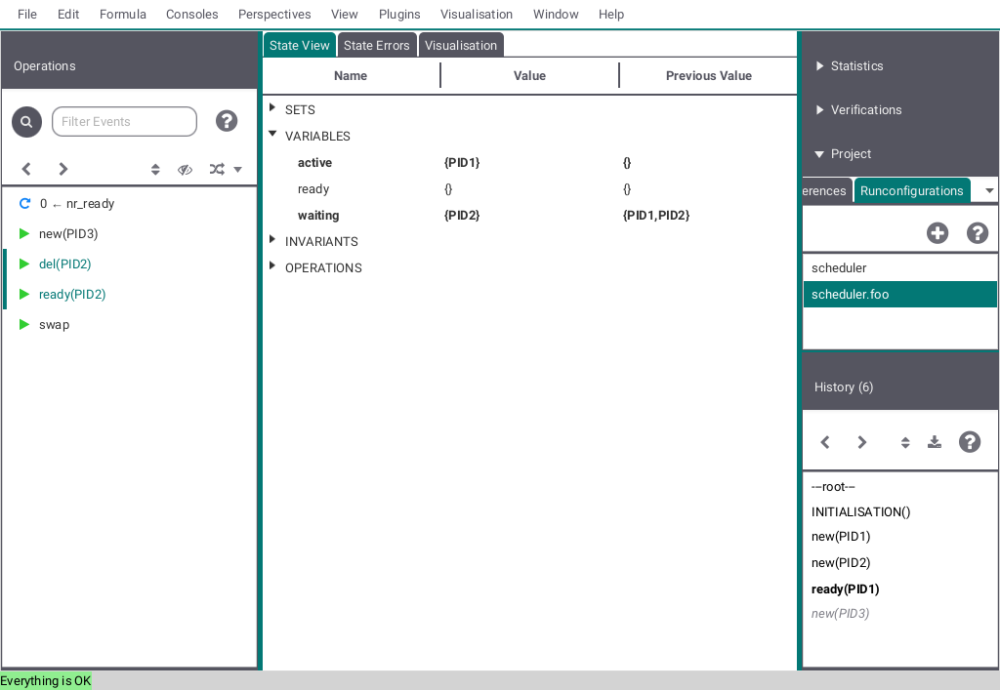
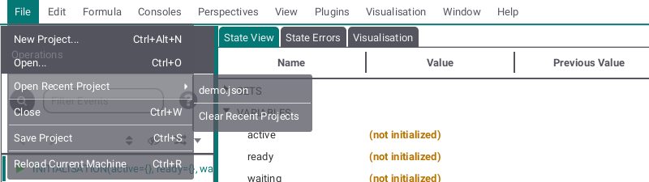
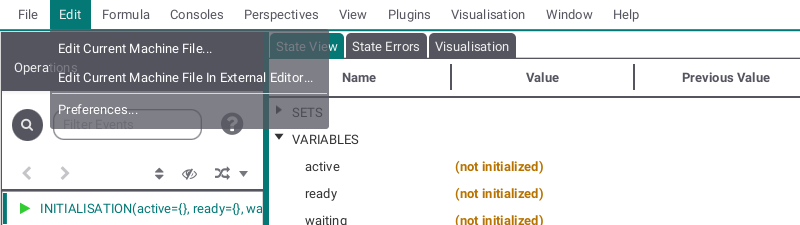
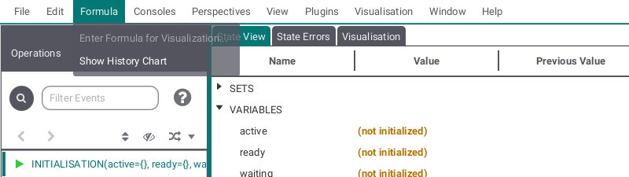
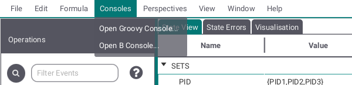
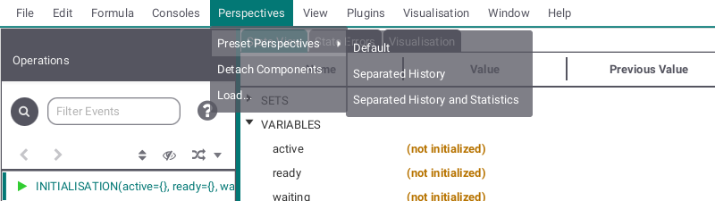
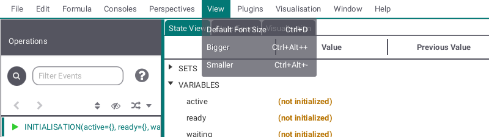
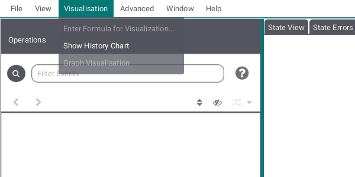
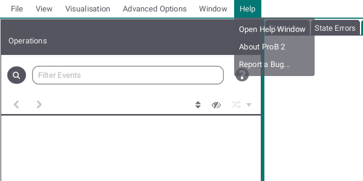

# The ProB2 JavaFX Main Window

By default the main window is split into three vertical panes (see below).

* In the left pane, the Operations view , showing the operations whose preconditions and guards are true in this state (the view also uses a blue circular arrow icon when an operation does not change the state);
* In the middle 
	* the [State View](Main%20View/State.md), containing the current state of the B machine, listing e.g., the current values of the machine variables,
	* the [State Errors View](Main%20View/State%20Errors.md), containing possible state errors and
	* the [Visualisation View](Main%20View/Visualisation.md), containing a visualisation, if provided by the user;
* In the right pane there are a variety of subviews, which can be activate:
	* [The History of operations leading to this state (History)](History.md)
	* [The Project view](Project.md)
	* [The Verification view](Verification.md)
	* [The Statistics view](Statistics.md)

# The ProB2 JavaFX Main Menu Bar

The menu bar contains the various commands to access the features of ProB. It includes the menus
* File,
* Edit,
* Formula,
* Consoles,
* Perspectives,
* View,
* Plugins,
* Visualisation,
* Window and
* Help

The File submenu allows you to create a new Project, open an existing project or a machine, open recent projects shown as list and/or clear the list of recent projects, close the ProB2 JavaFX UI, save your project or reload the currently running machine.

The Edit submenu provides two ways to edit the current machine (either in the editor provided by the ProB2 JavaFX UI or in the your operating systems standard editor) and allows to edit your general and global preferences by opening a seperate window.

Here you can add formulas for visualization and open the history chart window.

This submenu leads to two consoles, one Groovy, one B.

The Perspectives submenu allows you to change the appearance of the main view. The default view is shown at the top and two additional perspectives (Seperated History and Seperated History and Statistics) are preset. By ''Detach Components'' the view can be shown in seperate windows. ''Load'' allows you to make your own perspective by providing an FXML file containing the views but be aware that this might ruin the ability to detach components.

This submenu allows you to adjust font and button size in the ProB2 JavaFX UI.

With the Plugins submenu you can add and/or reload plugins as well as open a window showing all loaded plugins.

The Visualisation submenu allows you to select, stop ans detach a visualisation.

The Help submenu provides you with help about the ProB2 JavaFX UI, information about the ProB2 UI, ProB2 kernel, ProB CLI and Java version used here and a way to report issues regarding the ProB2 JavaFX UI.
 
