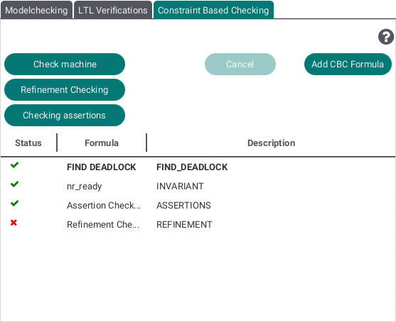

The Verification View provides 3 different methods to test a machine:

* Modelchecking
* LTL Verifications and
* Constraint Based Checking

In each tab you can add multiple tests to check you currently selected machine and interrupt the checking process by pressing the "Cancel" button.
##Modelchecking

By pressing the plus button you can add several model checking variants. The following view will be shown:

Select one of the search strategies (breadth first, depth first or a mix of both) and the checkboxes containing  different possible errors like deadlocks to be checked for. By pushing the "Model Check" button your selected variant will be added to the list shown at the top of the Modelchecking Tab.

##LTL Verifications

By pressing the "Add LTL Formula" or "Add LTL Pattern" buttons an editor for each respectively will be opened and you can add LTL formulas or patterns to the lists to be checked for. 
##Constraint Based Checking

