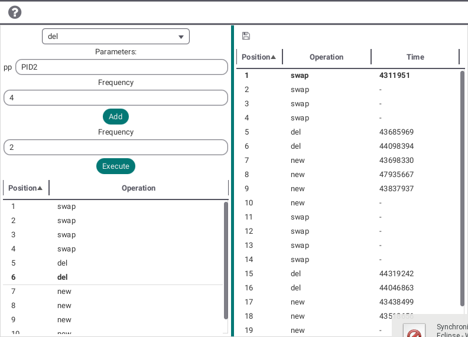

# Benchmarks

Die Benchmarks-Seite erlaubt es Laufzeiten von Operationen immer und immer wieder zu messen. Man kann die gerade aufführbaren Operationen in dem Pull-Down-Menü auswählen. Darunter werden die möglicherweise auftretenden Parameter der Operation angezeigt und können editiert werden.

Es gibt zwei Frequenzen, die nach Bedarf adjustiert werden können: Die erste ist für die Anzahl, die die Operation hintereinander (falls möglich) ausgeführt wird, wenn sie zu der Opreationsliste hinzugefügt wird, die zweite ist für die Anzahl, die die Liste von Operationen, die man angelegt hat, (falls möglich) ausgeführt wird, wenn der Ausführen-Knopf betätigt wird.

Unter dem Einstellungspanel wird die Liste der Operationen, die man erstellt hat, angezeigt. Man kann einzelne Operationen, die man entfernen möchte, löschen, indem man auf diese rechtsklickt.

Auf der rechten Seite wird eine Liste von Benchmarks angezeigt, wenn die Liste der Operationen ausgeführt wird.
