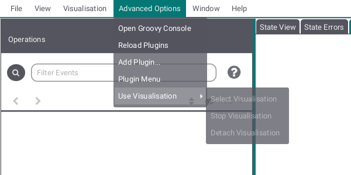

# Das ProB2 JavaFX Hauptfenster

In der Voreinstellung ist das Hauptfenster in drei vertikale Felder unterteilt (siehe unten).

* Auf der linken Seite, die Operationen-Ansicht, welche die Operationen anzeigt, deren Vor- und Schutzbedingungen in diesem Zustand wahr sind (Die Ansicht benutzt einen blauen Kreispfeil für den Fall, dass eine Operation den Zustand nicht ändert);
* In der Mitte
	* die [Zustandsansicht](Hauptansicht/Zustandsansicht.md), die den aktuellen Zustand der B-Maschine anzeigt und beispielsweise auflistet, welche Werte die Maschienvariablen derzeit haben,
	* die [Zustandsfehleransicht](Hauptansicht/Zustandsfehler.md), welche wohlmöglich auftretende Zustandsfehler anzeigt und 
	* die [Visualisierungsansicht](Hauptansicht/Visualisierung.md), die eine Visualisierung der Zustände anzeigt, falls vom Benutzer zur Verfügung gestellt;
* Im rechten Feld sind einige Unteransichten enthalten, die aktiviert werden können:
	* [Der Verlauf der Operationen, die zu diesem Zustand geführt haben (Verlauf)](Verlauf.md)
	* [Die Projektansicht](Projekt.md)
	* [Die Überprüfungsansicht](Überprüfungen.md)
	* [Die Statistikansicht](Statistik.md)

# Die ProB2 JavaFX Hauptmenüleiste

Die Menüleiste enthält die diversen Kommandos, um auf die Funktionen von ProB zuzugreifen. Sie beinhaltet die Menüs
* Datei,
* Ansicht,
* Visualisierung,
* Weitere Optionen,
* Fenster und
* Hilfe

Das Dateiuntermenü erlaubt es ein neues Projekt anzulegen, existierende Projekte oder Maschinen zu öffnen, ein Projekt aus der Liste der zuletzt verwendete Projekte zu öffnen und/oder die Liste der zuletzt verwendeten Projekte zu löschen, das ProB2 JavaFX UI zu schließen, das aktuelle Projekt zu speichern, die derzeitig laufende Maschine neu zu laden oder Einstellungen zu editieren.

Dieses Untermenü erlaubt es die Schrift- und Buttongröße in dem ProB2 JavaFX UI anzupassen, Perspektiven zu ändern, Komponenten abzutrennen oder in den Fullscreen-Modus zu gehen. Dieses UI bringt 3 verschiedene voreingestellte Perspektiven. Es ist erlaubt eigene Perspektiven zu nutzen, indem man eine FXML-Datei, die die Ansichten enthält, zur Verfügung stellt, aber man sollte sich dabei bewusst sein, dass das die Fähigkeit Komponenten abzutrennen zerstören kann.

Das Visualisierungsuntermenü stellt verschiedene Formen der Visualisierung zur Verfügung. Man kann eine Formel eingeben, sich das Zeitdiagramm anschauen oder einen Blick auf die Graphvisualisierung werfen.

Dieses Untermenü stellt eine Groovy-Konsole zur Verfügung und erlaubt es Plugins und eigene Visualisierungen zu verwalten.

Das Hilfeuntermenü stellt Hilfe zum ProB2 JavaFX UI, Informationen zu dem ProB2 UI, dem ProB2 Kernel, dem ProB CLI und der Javaversion, die hier benutzt werden, und einen Weg, Probleme mit dem ProB2 JavaFX UI zu melden, zur Verfügung.
