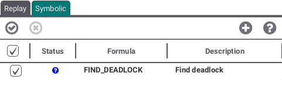

# Animation View
The Animation View is divided in two sections: Trace Replay and Symbolic Animation.
## <a id="Trace"> Trace Replay </a>

With this tab you can add and load traces of machines.

By hitting the check button every selected trace will be executed and checked without rewriting your current history of operations. The x button will cancel an ongoing execution of a trace. The folder button allows you to add traces. The questionsmark button will open the help page regarding Trace Replay.

If you check your traces by double clicking or selecting Replay Trace after clicking right on a trace, the history of operations will be overwritten by the operations stored in the trace.

If errors occurr, you can inspect them by clicking right and selecting Show Error.

You can remove traces by clicking right and select Delete Trace.
## <a id="Symbolic"> Symbolic Animation </a> 

