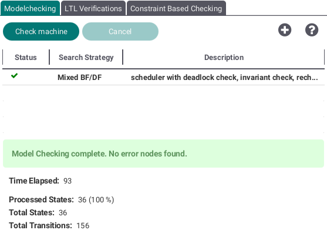
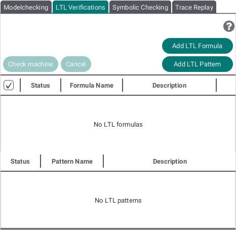

# Verification View

The Verification View provides 3 different methods to test a machine:

* Modelchecking,
* LTL Verifications and
* Symbolic Checking

In each tab you can add multiple tests to check you currently selected machine and interrupt the checking process by pressing the "Cancel" button.

## <a id="Model"> Modelchecking </a>

By pressing the plus button you can add several model checking variants. The following view will be shown:

Select one of the search strategies (breadth first, depth first or a mix of both) and the checkboxes containing  different possible errors like deadlocks to be checked for. By pushing the "Model Check" button your selected variant will be added to the list shown at the top of the Modelchecking Tab.

## <a id="LTL"> LTL Verifications </a>

By pressing the "Add LTL Formula" or "Add LTL Pattern" buttons an editor for each respectively will be opened and you can add LTL formulas or patterns to the lists to be checked for.

### Summary of LTL Syntax supported by ProB
*   use {...} for B predicates,
*   G,F,X,U,W,R,true,false,not,&,or and => are part of the supported LTL syntax,
*   use e(op) to check if an operation op is enabled,
*   use deadlock to check if a state is deadlocked,
*   use deadlock(op1,...,opk) with k>0 to check if all operations in the brackets are disabled,
*   use controller(op1,...,opk) with k>0 to check if exactly one of the operations in the brackets is enabled,
*   use deterministic(op1,...,opk) with k>0 to check if maximum one of the operations in the brackets is enabled,
*   use sink to check if no operation is enabled that leads to another state,
*   use brackets to check what is the next operation, e.g. [reset] => X{db={}},
*   Past-LTL is supported: Y,H,O,S,T are the duals to X,G,F,U,R.

#### Setting Fairness Constraints
*   Give fairness constraints by means of implication: fair => f, where "fair" are the fairness constraints and "f" is LTL-formula intended to be checked.
*   Use WF(-) and SF(-) to set action-based weak and strong fairness constraints, respectively,
*   use WEF and SEF to search for bad paths that are weakly and strongly fair with respect to all transitions, respectively.

## <a id="Symbolic"> Symbolic Checking </a>

By pressing the plus button you can add several symbolic checking variants. The following view will be shown:

The dropdown menu allows you to select the type of check. Some variants of the symbolic checking might need additional parameters (e.g. Invariant needs an operation).
